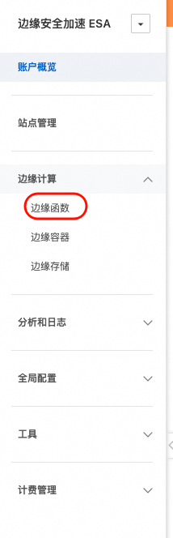
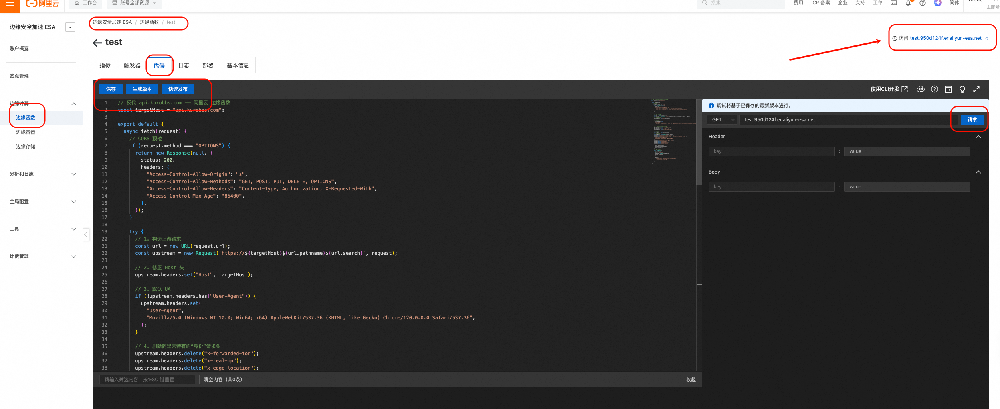
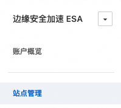
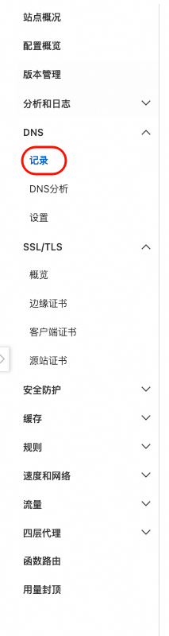
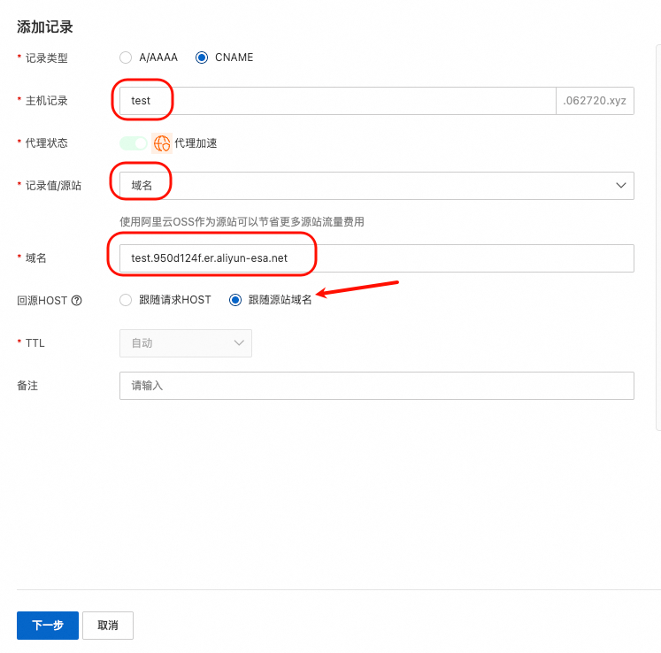
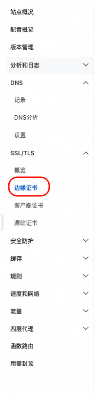

# 🐱 阿里 ESA 部署指南

> 使用 边缘安全加速(ESA) -> 边缘函数, 无服务器平台部署 RoverProxy

## 费用说明

> [免费套餐](https://help.aliyun.com/zh/edge-security-acceleration/esa/product-overview/how-to-get-esa-for-free)

> 发帖不限次数获取基础版 -_-

## 📋 前置要求

- 阿里云账号
- 已开通边缘安全加速(ESA)服务
- 已添加站点到阿里云（必需）

## 部署步骤

1. 登录[ESA控制台](https://esa.console.aliyun.com), 绑定站点

2. 点击 **边缘计算** -> **边缘函数**

3. **创建函数** -> 随便一个模板 -> **函数名称**[随便写，如 RoverProxy] -> 提交

4. 点击你已经创建好的 **边缘函数** -> 选择 **代码** 标签 -> 在代码编辑器中，复制 [`ali_function.js`](../ali_function.js) 的完整代码 -> **保存** 并 **发布**

5. 可以使用右侧的请求进行测试

6. 记录右上角的阿里云给你的域名，如 **test.950d124f.er.aliyun-esa.net**, 如果你不想绑定自己的域名，到这就可以结束了。

7. 点击**站点管理** -> 点击你的域名

8. 点击 **DNS** -> **记录** -> 新增一条记录

9. 参考以下填入 -> 选择**API接口**

10. 增加证书

11. 域名CNAME的逻辑自行研究即可

## 📚 相关链接

- [阿里控制台](https://home.console.aliyun.com/home/dashboard/ProductAndService)
- [阿里esa控制台](https://esa.console.aliyun.com)
- [阿里免费套餐](https://help.aliyun.com/zh/edge-security-acceleration/esa/product-overview/how-to-get-esa-for-free)