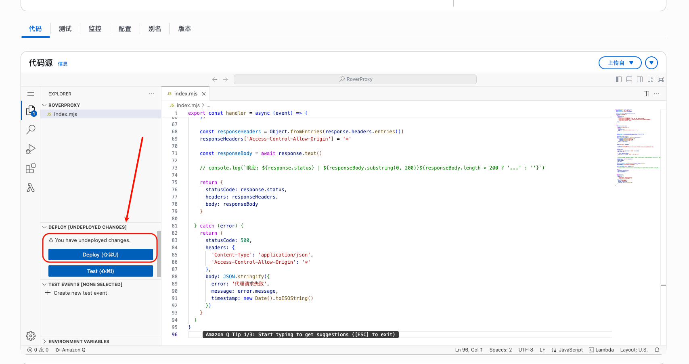

# 🚀 AWS Lambda 部署指南

> 使用 AWS Lambda 无服务器平台部署 RoverProxy

## 💰 费用说明

AWS Lambda 按使用量计费，非常适合轻量级代理服务：

**免费额度**（每月）：
- 100 万次请求
- 400,000 GB-秒计算时间

**超出免费额度后**：
- 请求费用：每 100 万次请求 $0.20
- 计算费用：每 GB-秒 $0.0000166667

## 🌍 区域选择建议

为了获得最佳性能，建议选择离目标用户最近的 AWS 区域：

- **亚太地区**：`ap-northeast-1`（东京）、`ap-southeast-1`（新加坡）
- **北美地区**：`us-east-1`（弗吉尼亚）、`us-west-2`（俄勒冈）
- **欧洲地区**：`eu-west-1`（爱尔兰）


## 🌐 网页控制台部署

### 前置要求
- AWS 账号（[免费注册](https://aws.amazon.com/free/)）

### 步骤 1：创建 Lambda 函数

1. **登录 AWS 控制台**
   - 访问 [AWS Lambda 控制台](https://console.aws.amazon.com/lambda/)
   - 使用您的 AWS 账号登录

2. **创建新函数**
   - 点击橙色的 **"创建函数"** 按钮
   - 选择 **"从头开始创作"** 选项

3. **配置基本信息**
   - **函数名称**：输入 `RoverProxy`
   - **运行时**：选择 `Node.js 22.x`
   - **架构**：保持默认 `x86_64`
   

4. **其他配置**
   - **启用函数 URL **：勾选 `Enable`
   - **授权类型**：选择 **"None"**

5. **完成创建**
   - 点击 **"创建函数"** 按钮


### 步骤 2：上传代码

1. **进入代码编辑器**
   - 在函数详情页面，找到 **"代码"** 选项卡
   - 在代码编辑器中，复制 [`aws_lambda.js`](../aws_lambda.js) 的完整代码
   - 粘贴到 `index.mjs` 文件中
   - 点击 **"Deploy"** 按钮保存代码



## 🎯 使用方式
部署完成后，您的代理服务就可以使用了！

**代理地址格式**：
```
https://your-function-url.lambda-url.region.on.aws
```

## 📚 相关链接

- [AWS Lambda 控制台](https://console.aws.amazon.com/lambda/)
- [AWS Lambda 官方文档](https://docs.aws.amazon.com/lambda/)
- [AWS 免费套餐](https://aws.amazon.com/free/)
- [CloudWatch 日志控制台](https://console.aws.amazon.com/cloudwatch/)
