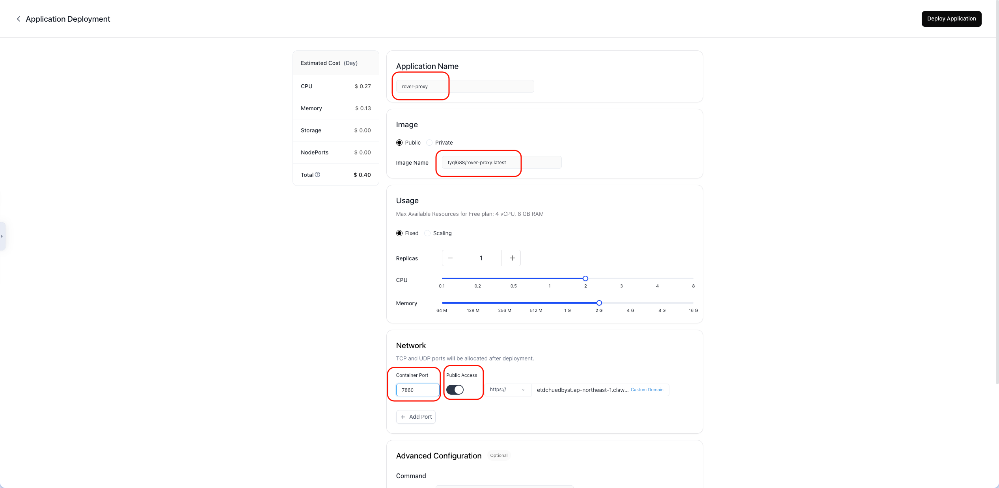
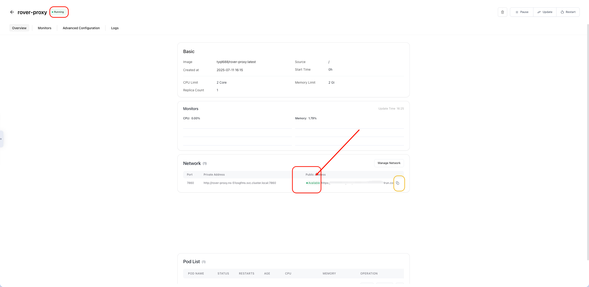

# 🚀 Claw Cloud 部署

## ✨ 优势介绍

- 🆓 **完全免费**：利用平台的免费额度，无需支付费用
- 🛠️ **操作简单**：部署过程直观，易于上手
- 🌏 **国内友好**：部分节点（如日本）对中国大陆访问速度较好
- 📊 **流量充足**：每月提供 10GB 免费流量，对于个人使用 API 来说通常绰绰有余

## 🔑 前置条件（满足其一即可）

- **GitHub 账号**：拥有一个注册时间超过 180 天的 GitHub 账号（每月可获得 $5 赠金，理论永久）
- **Gmail 账号**：使用 Gmail 账号登录（只能获得一个月 $5 赠金），多个谷歌账号即可无限续杯

## 🔧 部署步骤

### 第一步：登录控制台

1. 访问 [Claw Cloud 控制台](https://console.run.claw.cloud/signin)
2. 使用您的 **GitHub** 或 **Gmail** 账号登录
3. 确认账号符合前置条件要求

### 第二步：选择区域（首次登录）
1. 首次登录时会提示选择服务器区域。
2. 此选择后续可以更改。

### 第三步：创建应用
1. 在控制台主界面，找到并点击 **APP Launchpad**。
2. 点击 **Create APP** 按钮开始创建。
3. **配置应用信息**
    *   **Application Name:** 填写一个应用名称 `rover-proxy`
    *   **Image Name:** 输入镜像地址 `tyql688/rover-proxy:latest`
    *   **Usage:** 可自行调整，推荐 2c2g
    *   **Ports:** 配置端口为7860并打开`Public Access`按钮
4. 返回页面顶部，点击 **Deploy Application** 按钮。

### 第四步：等待部署完成&&访问服务
1. `public Address` 为**pending**状态，表示正在部署中。
2. 等待状态变为 **Available**，表示部署完成。

