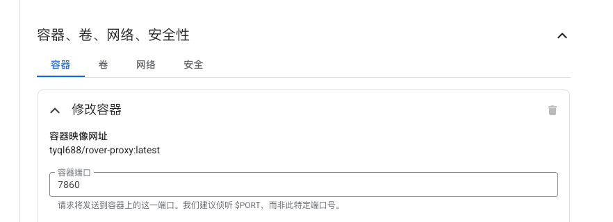

# ☁️ Google Cloud Run 部署指南

> 通过 Google Cloud Console 网页界面部署 RoverProxy 反向代理服务

## 前情摘要

1. Google Cloud Run 每月提供：
   - **每月前 200 万个请求免费**
   - **每月前 18 万 vCPU 秒**
   - **每月前 36 万 GiB 秒**

## 🚀 部署步骤

1. 点击链接跳转 [Cloud Run](https://console.cloud.google.com/run/create)

2. **容器镜像 URL** 输入：`tyql688/rover-proxy:latest`
3. **服务名称** 输入：`rover-proxy`
4. **区域** 选择：
   - 推荐亚洲用户选择：`asia-east1 (台湾)`
   - 或选择：`asia-northeast1 (东京)`
5. **身份认证**
   1. 勾选 **使用 IAM 对传入请求进行身份验证** 
      1. 选择 **允许未经过身份验证的调用**
6. **结算**
   1. 勾选 **基于请求**
7. **服务扩缩:** 选择 **自动扩缩** 
   1. 实例数下限： 0
   2. 实例数上限： 5

8. 点击**容器、连接、安全性**展开高级选项:
   1. **容器端口**：`7860`

9. 点击 **"创建"** 按钮
10.  等待部署完成（通常需要 1-3 分钟）

## 🔧 部署后配置

### 获取服务 URL

1. 在 Cloud Run 服务列表中找到 `rover-proxy`
2. 点击服务名称进入详情页
3. 复制 **"URL"** 字段的链接
4. URL 格式类似：`https://rover-proxy-xxxxxxxxx-xx.a.run.app`

## 🔗 有用链接

- [Google Cloud Console](https://console.cloud.google.com/)
- [Cloud Run 文档](https://cloud.google.com/run/docs)
- [Cloud Run 定价计算器](https://cloud.google.com/run/pricing?_gl=1*h362w*_ga*OTk2NjQ1NjE3LjE3NTA5OTExOTQ.*_ga_WH2QY8WWF5*czE3NTIzODcxMzEkbzEwJGcxJHQxNzUyMzg3MzA4JGo1MSRsMCRoMA..&hl=zh_cn)

